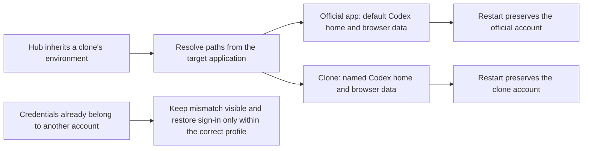

# Persistent desktop account isolation implementation plan

**Goal:** Keep the official ChatGPT application and each MultiCodex clone on their own account after Route Hub quits and the applications restart. Build the multi-account implementation from this independent repository.

**Architecture:** An application target owns both its Codex home and browser data directory. A shared launch function supplies those paths explicitly, replacing inherited account environment at every desktop launch. Named Hub browser partitions, tunnels and account registries remain independent. Account mismatch must remain an error; never copy credentials between accounts.

**Tech stack:** CommonJS, Electron, TypeScript/Bun, macOS Launch Services, MultiCodex Bash launchers.

## Ownership

MultiCodex owns clone creation, the embedded `multicodex-launcher`, profile directories and clone updates. Its local checkout is `/Users/wickedmc/.local/share/codex-route-hub/MultiCodex`, with upstream `https://github.com/mahdi-salmanzade/MultiCodex`. Its location under a `codex-route-hub` directory does not make it part of this repository. Route Hub owns browser partitions, bridges, tunnels and the background restart it requests while changing routes. This change repairs only that launch boundary; it does not claim to repair MultiCodex's native ChatGPT sign-in persistence.

The installed clone's embedded launcher and bundle identity remain present and its signature verifies. A sign-in page therefore must not be described as proof that the profile directory disappeared. The native desktop login, the Codex auth cache and the Hub's browser session require separate verification.

## Situation → decision → expected result

## Repository boundary

- Work only in `/Users/wickedmc/all_codes/codex-route-hub`, with its own `.git` directory and no Git alternates or linked worktrees.
- Base: `8087ed5`, including the previously recovered multi-account and multi-browser implementation.
- Branch: `codex/multi-account-isolation`; remote: `babybearofficial/codex-route-hub` (independent GitHub repository).
- The old checkout and its worktrees are reference material, not build inputs.

## Implementation and verification

1. Add `launcher/electron/desktop-launch.cjs` to resolve explicit desktop identity paths and construct a background launch with a sanitized environment. Use it from `codex-client-lifecycle.cjs` and `profile-manager.cjs`. Stage it in the packaged profile manager.
2. Keep named paths in `named-instance.cjs`, including the desktop browser data path. Prevent a shared Hub launched from a clone from treating that clone's `CODEX_HOME` as the default client. Preserve explicit isolated harness overrides.
3. Implement first, then add and run direct Node regressions for contaminated parent environments, both profiles, repeated restarts, recovery reopen, and CLI launch behavior. Run existing launcher and runtime checks.
4. Bump the release version; build and verify the native macOS package from this checkout. Run packaged smoke with isolated state and no live client restart. Review the change before publishing the branch.
5. Verify installed package provenance and live target paths. Existing godel sign-in is a separate acceptance gate if no valid session remains: do not label a startup-only check as account persistence.

## Evidence boundaries

Initial inspection found the official app, clone and Hub carrying the same clone `CODEX_HOME`. Installed 5.0.10 launch modules match the source. Launch Services global overrides and application plist account overrides were absent. The two Hub browser registries retain distinct account identities, while the desktop auth files currently match. No credentials or private logs belong in this repository.

## Verification

- The legacy lifecycle's mocked reopen supplied neither `CODEX_HOME` nor `CODEX_ELECTRON_USER_DATA_PATH`; no real applications were launched in that reproduction.
- Launcher suite: 413 passed, 1 skipped. Focused isolation/lifecycle/profile suite after final test portability edits: 22 passed.
- Runtime suite: 750 passed, 1 skipped. Root and launcher TypeScript checks passed. Version synchronization passed for 5.0.11 with Bun 1.4.0.
- Independent review identified the bare inherited `CODEX_HOME` fallback; it was removed outside explicit isolated launcher environments, with a regression test. Follow-up review found no further significant issue in the Hub change.
- Native macOS arm64 5.0.11 ZIP compiled and signed from this repository. This is a build result, not evidence that the MultiCodex native sign-in loss is repaired.
