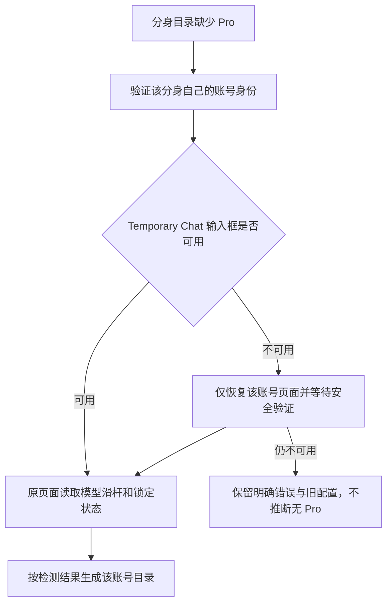

# 分身 Pro 模型目录修复（5.0.13）

## 现场与原因

- 读取用户指定任务 `01a0e3ae-22d0-7aa0-b9a4-720279bf29be` 及此前的只读诊断。
- 已安装版本为 5.0.12。分身保存的 Sol、Extra High、Pro 能力均为 false；这会生成 Luna/Think 目录。
- 分身自己的网页曾显示 Pro 控件。使用应用原样的登录探测，请求头包含 `accept: application/json`，可取得有效服务器会话。
- 通过现有会话检查接口复现：能力检查强制刷新该页面后，页面停在安全验证，输入框消失，服务器会话仍然有效；旧代码将这组状态报告为登录超时。该请求未同步模型、停止代理、重启客户端或改写路由。
- 另一次会话接口读取出现 403、`cf-mitigated: challenge`。原恢复过滤器只覆盖 `/backend-api/*`，遗漏了 `/api/auth/session`；不能把这次读取与原先目录 502 认定为同一故障。

## 决策与结果

1. 可用且通过身份校验的页面原地检测模型，移除每次能力检查前的无条件硬刷新。
2. 登录身份与输入框就绪分别记录；安全验证阻塞不再伪装成账号退出或普通登录超时。
3. 将精确的会话接口纳入已有的、有界、按账号隔离的安全验证恢复。运行中的网页任务、其他账号的页面和无关 URL 均受原有隔离限制。
4. 身份核验等待本账号恢复完成后重新验证一次；即使恢复在请求返回前已完成，也不会沿用先前失败结果。
5. 每次手动检查前后重新确认隐藏主视图尺寸，处理 helper 断开 CDP 后 Chromium 清空视口而 Electron 仍保留旧尺寸的情况。

不根据用户声明或旧令牌直接写入 Pro 标志，不复制主账号权限、cookie、配置或 Tunnel。模型仍由当前账号真实控件决定。能力检查失败时沿用现有 setup 回滚和客户端恢复逻辑。

## 上游比较

对照 `miuuyy/codex-chatgpt-web` 的 6.1.2：发布提交 `76aa5d1`、检查时分支头 `2d73f62`。其能力检查仍有无条件刷新行为，其认证更新侧重 cookie 通知与重新登录状态，不能直接解决本次分身页面刷新后的验证阻断。

本次采用 Route Hub 自有的按账号修复，没有整体合并上游认证、单账号启动或 Saved chats；原有模型滑杆检测继续使用此前选择性采用的 6.1.0/6.1.1 兼容实现。详见[上游功能清单](../upstream-features.zh-CN.md)。

## 验证范围

- 定向 Launcher 测试覆盖现有 browser-host、routing-switch、批量路由及 RuntimeHost；新增页面原地检查、账号不符、会话挑战、输入框不可用、恢复竞态和重复隐藏检查测试。
- 真实无头 Chromium 使用两个独立、无真实凭据的浏览器上下文：Pro 账号完整生成全部 Web 档位，非 Pro 账号不继承 Pro；原生模型和输入草稿保留，各自只导航一次。
- 真实账号安装后验收仍需该分身通过页面安全验证，然后在用户允许的激活窗口同步模型。源码与安装包验证不代表已替换当前运行应用。
- 先前日志中的间歇性原生目录 502 没有新的底层传输证据，本次不以改权限、伪造目录或盲目重试掩盖它。

### 已执行结果

- Launcher 全套：423 通过、1 项平台跳过、0 失败；包含多账号批量路由、客户端隔离和运行时回滚。
- session、目录、setup 和真实 Chromium 集成测试：47 通过、0 失败。
- 根 TypeScript 检查、版本一致性检查（5.0.13 / Bun 1.4.0）、Launcher 类型检查及生产构建通过。
- macOS arm64 DMG：镜像校验和、本地签名完整性、运行时清单通过；包内 37 个 Launcher 模块和 6 个 profile-manager 模块均与源码逐字节一致。
- 空实例注册表、隔离配置目录、禁止客户端重启的打包启动验证通过：`PACKAGED_LAUNCHER_SMOKE_OK darwin/arm64`。
- DMG：`launcher/artifacts/codex-route-hub-5.0.13-mac-arm64.dmg`，156.6 MiB。
- SHA-256：`5b2ebcec28de0a66b4e2433dad553bfcff99eb2efde55432ca55319e569f8bc0`。
- 修复提交：`efed984`。未安装替换运行中的 5.0.12，也未改写两个真实账号的运行配置；分身 Pro 真机目录验收仍待安全验证与激活。
