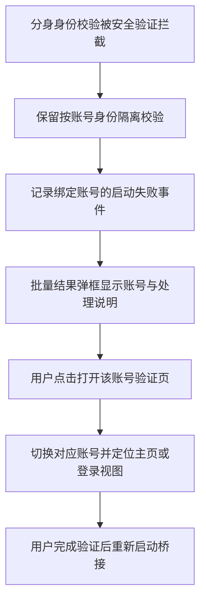

# 5.0.15：账号日志与启动失败提示

## 本次未重启分身的原因

5.0.14 运行时，分身启动在 startAccountBridge 的账号身份校验阶段被 ChatGPT 安全验证拒绝，尚未进入 CodexClientLifecycle.stop。只读状态确认：主账号已启动、clientRestarted=true、模型目录已验证；分身 enabled=false、busy=false、last=null。界面内批量结果已有错误，但未弹出提示，容易被理解为仍在等待。

## 情境—决策—结果

- 每个 named context 使用独立账号日志包装器，身份绑定在事件产生端，后台账号不会因切换当前选中账号而串标。
- runtime、browser、supervisor、routing 事件均继承账号标记。批量操作另记开始、结果和失败。
- 启动配置与活动页显示账号；旧日志及全局事件标为“应用 / 历史未标记”，不猜测归属。
- 日志详情兼容 message 和 stdout/stderr 的 line。
- 启动/停止批量失败与降级结果弹出提示；同步操作返回提示或抛出错误也弹框。自动刷新不反复弹相同错误。
- 弹框提供对应账号的浏览器入口，激活主页视图并保留可能存在的登录视图，不销毁验证码现场，不代替用户完成验证。
- 多开、多账号身份校验、Tunnel 绑定和独立客户端生命周期保持原样。
- 本次为本项目反馈体验修复，没有新增上游功能移植。

## 验证

- 桌面端首轮：424 通过，1 平台跳过，0 失败。
- 新增账号日志交错写入、固定归属、防覆盖及凭据脱敏回归测试。
- 本机仅做只读状态和界面诊断；未重启现有路由、未替换正在运行的应用。
