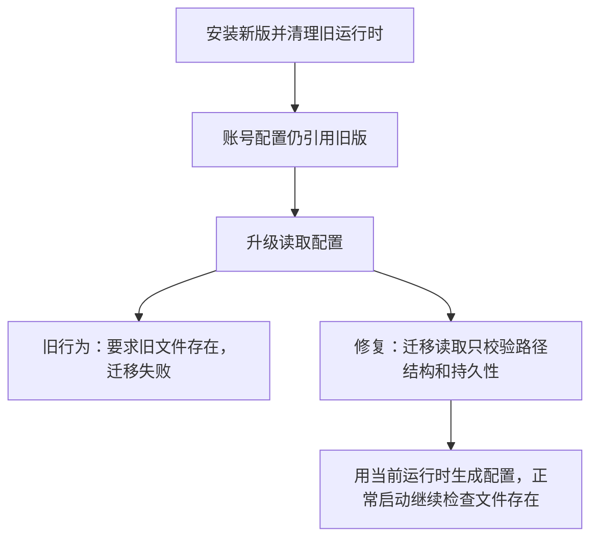

# 5.0.14：旧运行时被清理后无法迁移配置

## 本机证据

- 已安装应用为 5.0.13，版本目录仅剩 5.0.13-darwin-arm64，其中 runtime/bun 存在。
- 两个独立账号的配置均仍为 releaseVersion 5.0.12，runtimeCommand 指向已不存在的 5.0.12 目录。
- 截图报错准确对应 src/config.ts 的可执行文件存在性校验。

## 原因

ensurePackagedRuntime 安装并校验新版后清理旧版本。随后账号升级 setup 通过 loadConfigForSetup 读取旧配置，旧实现与正常启动共用严格的文件存在性校验。因此还没运行到 baseConfig 替换 runtimeCommand 的步骤，就因旧 bun 不存在而退出。这是本项目运行时清理与配置迁移衔接的缺陷。

## 修复范围

- 仅 setup 迁移读取允许旧可执行文件缺失，仍拒绝空命令、相对路径和临时目录路径。
- 正常 loadConfig 和 assertDurableRuntimeCommand 保持严格校验。
- baseConfig 继续使用 currentRuntimeCommand 校验并写入实际运行的新版命令。
- 不改账号、端口、浏览器分区、应用分身、多桥接或 Pro 权限逻辑。
- 不复制旧运行时，不添加备份目录，不改变磁盘清理策略。
- 本次为本项目缺陷修复，没有移植新的上游 feature。

## 验证

- runtime-layout 与 setup-lifecycle：28 项通过；包含旧运行时已消失时的迁移读取、正常启动拒绝、非法路径拒绝、新命令替换旧命令。
- 根目录 TypeScript 检查通过。
- 本轮不修改真实账号配置、不停止或重启现有路由。安装包与本机实际激活验证分别记录，源码验证不代表真实账号已经迁移成功。
